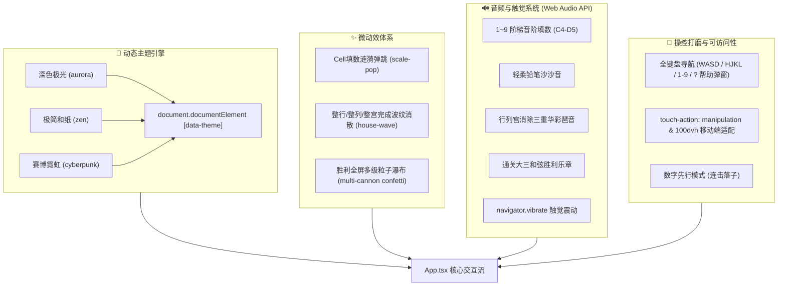

# 阶段四技术设计方案：体验打磨与多主题定制 (Phase 4 Plan)

> **目标**：打造业界一流、极度丝滑、手感出众的现代化 Web 数独。  
> **核心方向**：3 套精美主题深度定制、微动效体系（填数弹跳/行宫列消除波纹/胜利全屏特效）、纯合成音效与触觉反馈系统、全键盘快捷键覆盖与移动端触控极致打磨。

---

## 一、系统架构与模块设计

---

## 二、详细技术方案

### 1. 3 套精致主题深度定制 (Tailwind + CSS 变量)
确保盘面、高亮、候选数、各种状态与 5 个模态弹窗在所有主题下均有极佳的对比度与视觉美感：

1. **深色极光 (`aurora`)**：
   - 默认暗黑科技风。深曜石黑背景（`#020617`），极光蓝青色（`#38bdf8` / `#818cf8`）高亮与强调。
2. **极简和纸 (`zen`)**：
   - 暖米白宣纸底色（`#f8f5ee` / `#efe9dc`），水墨黑字（`#1c1917`），朱砂红冲突（`#b91c1c`），温润赭石（`#b45309`）强调。
   - 修复和纸模式下弹窗背景、格子高亮、按钮对比度，保证在明亮环境下极度护眼、沉静优雅。
3. **赛博霓虹 (`cyberpunk`)**：
   - 黑客终端风格。极深墨绿黑背景（`#020806`），高饱和毒液荧光绿（`#10b981` / `#00ff9d`），赛博扫描网格感。
- **换肤实现机制**：
  在 `App.tsx` 中同步将 `settings.theme` 设置到根容器与 `document.documentElement.setAttribute('data-theme', theme)`，利用 scoped css 类或 tailwind 选择器全面覆盖。

### 2. 微动效体系 (Micro-Animations)
- **填数弹跳 (`scale-pop`)**：
  在填入或修改数字时，数字元素呈现轻微弹性缩放动画（`scale(1.15) -> scale(1)`，耗时 180ms，ease-out），赋予每一次落子清晰的段落感。
- **整行/整列/整宫完成消除波纹 (`house-wave`)**：
  - 每当一次有效填数使得某行、某列或某 3x3 宫首次集齐 1-9 无冲突时，检测并识别受影响的全部 9 个格子。
  - 触发持续 600ms 的波纹发光动画（金光扩散/青芒闪烁），并同时联动播放华彩音效与微弱震动。
- **胜利全屏庆祝**：
  - 胜利弹窗触发双侧加农炮粒子对喷（左右两侧 60 度角喷射彩色纸屑持续 2.5 秒），强化通关成就感。

### 3. 音效与触觉反馈系统 (`src/utils/sound.ts`)
- **阶梯音阶填数**：
  数字 1 到 9 分别绑定不同频阶（C4, D4, E4, F4, G4, A4, B4, C5, D5），连续填数时自然构成悦耳旋律。
- **铅笔音效**：
  候选数笔记使用微弱短促的高频白噪声/带通滤波，拟真铅笔在粗糙纸面上的摩擦沙沙声。
- **消除华彩音**：
  行/列/宫消除时触发快速向上琶音（如 E5-G#5-B5-E6），如同解开谜题的清脆铃铛。
- **触觉反馈**：
  在支持 `navigator.vibrate` 的移动端设备上：
  - 普通填数：10ms 轻微触觉脉冲。
  - 消除波纹：`[15, 30, 20]` 律动震动。
  - 错误提示：`[40, 60, 40]` 警示震动。
- **严格静音控制**：
  所有音效在 `soundEnabled: false` 时彻底旁路跳过，不创建 AudioContext。

### 4. 键盘操作指南与全套快捷键
- 强化快捷键监听：
  - 支持 `?` / `Shift + /` 随时唤起快捷键指南弹窗 `HelpModal`。
  - 支持全向光标移动：方向键、`W/A/S/D`、`H/J/K/L`（Vim 键位）。
  - 支持 `1-9` 填数，`Backspace / Delete / 0` 擦除。
  - 支持 `N` / `Space` 切换笔记模式。
  - 支持 `Z` / `Ctrl+Z` 撤销，`Y` / `Ctrl+Y` / `Ctrl+Shift+Z` 重做。
  - 支持 `H` 触发智能提示，`P` 暂停。
  - 在页面顶部 Header 增加显著快捷键 `?` 按钮，便于鼠标/触摸用户查阅。

### 5. 移动端触控与视口优化
- 容器采用 `100dvh`（Dynamic Viewport Height），杜绝移动 Safari / Chrome 地址栏收缩引发的页面抖动与底部遮挡。
- 添加 `touch-action: manipulation`，消除 iOS / Android 浏览器默认的 300ms 双击放大等待延迟。
- 完善数字先行模式（`fastInputMode`）：开启后高亮键盘数字，点击棋盘空格直接秒落子，极大减轻移动端单手操作疲劳。

---

## 三、自检与验收标准 (Checklist)

1. **3 套主题体验对比**：
   - 切换至 `zen`（和纸）：文字清晰易读，背景温润米色，弹窗无黑色突兀色块。
   - 切换至 `cyberpunk`（赛博）：荧光绿高亮震撼，暗部深邃。
   - 切换至 `aurora`（极光）：默认科技暗黑质感。
2. **动效手感**：
   - 填数数字有弹跳微动效，无卡顿。
   - 行/列/宫完成瞬间触发 9 格连环波纹。
   - 通关时粒子礼花与音效协调震撼。
3. **音效与触控**：
   - 1-9 音阶准确，笔记、擦除、错误、消除音效齐备。
   - 关掉音效开关后绝对静音。
   - 键盘按下 `?` 立即呼出指南，全按键正常生效。
4. **自动化工程质量**：
   - Vitest 全测试通过，0 警告 0 报错。
   - Oxlint 0 警告 0 错误。
   - TypeScript build 0 错误。
